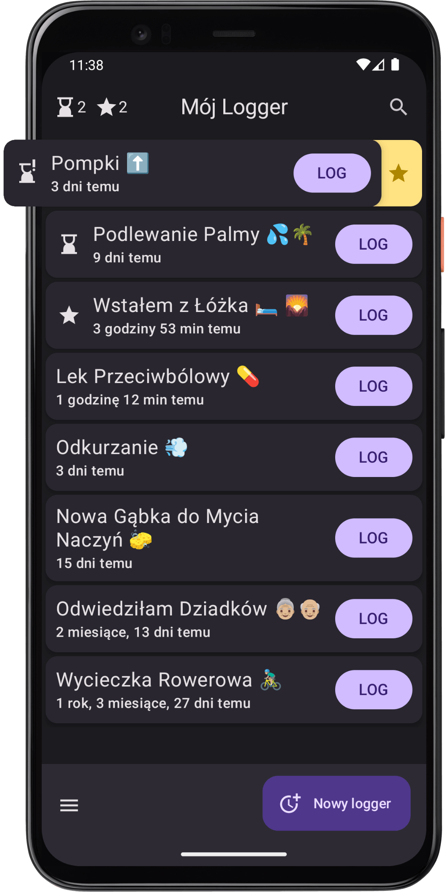

# Co logować?

W tej aplikacji możesz śledzić dowolne wydarzenia i działania. Jeśli nic nie przychodzi Ci do głowy, może zainspirują Cię poniższe kategorie i przykłady 😊:

1. **to, co chcesz robić częściej**
   - aktywność fizyczna (spacer, konkretny sport 🏐🏊‍♂️⛳, konkretne ćwiczenie...)
   - inna czynność prozdrowotna (rozciąganie, zimny prysznic, medytacja 🧘‍♀️...)
   - spotkania ze znajomymi, rodziną ❤️
   - czytanie książki 📖 z kawusią ☕

2. **to, co chcesz robić rzadziej**
   - szkodliwe nawyki (alkohol 🍷, papierosy, obgryzanie paznokci...)
   - niezdrowe jedzenie (fast foody 🍔, słodycze 🍬...)
   - scrollowanie social mediów 📱

3. **to, co chcesz robić regularnie**
   - odkurzanie, sprzątanie 🧹
   - podlewanie kwiatków 🪴
   - czyszczenie kolanka pod zlewem

4. **to, co po prostu interesuje Cię, jak często się dzieje**
   - wymiana czegoś: gąbki do mycia naczyń, szczoteczki, baterii 🔋, worka do odkurzacza...
   - coś wkurzającego, co ciągle dzieje się w Twojej pracy :P
   - rzęsa w oku... 👁️🪡
   - wyjście do kina 🍿 lub teatru

5. **to, co się dzieje w pewnym kontekście i chcesz to utrwalić**
   - szybki dziennik (np. wspomnienia z wakacji 🏝️, wyjątkowych wydarzeń...)
   - kamienie milowe (np. projektu, procesu dążenia do celu 🎯, realizacji postanowienia...)

Ogranicza Cię tylko Twoja wyobraźnia 🌌 i ciekawość 🧐😊.

Ekran główny aplikacji będzie wyglądać tak:

---
<a href="/">Przejdź do strony głównej</a>
