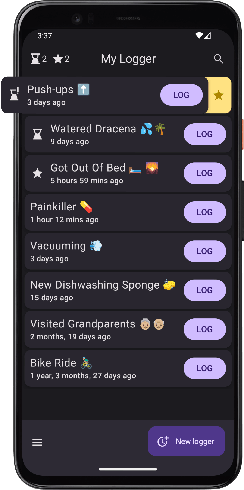

# What to log?

In this app, you can track any events and activities.  
If nothing comes to mind, maybe the categories and examples below will inspire you 😊:

1. **things you want to do more often**
   - physical activity (walking, a specific sport 🏐🏊‍♂️⛳, a specific exercise...)
   - other health-related activities (stretching, cold shower, meditation 🧘‍♀️...)
   - meeting friends or family ❤️
   - reading a book 📖 with a cup of coffee ☕

2. **things you want to do less often**
   - harmful habits (alcohol 🍷, smoking, nail biting...)
   - unhealthy food (fast food 🍔, sweets 🍬...)
   - scrolling social media 📱

3. **things you want to do regularly**
   - vacuuming, cleaning 🧹
   - watering plants 🪴
   - cleaning the pipe under the sink

4. **things you’re just curious how often they happen**
   - replacements: dish sponge, toothbrush, batteries 🔋, vacuum cleaner bag...
   - something annoying that keeps happening at your job :P
   - an eyelash in your eye... 👁️🪡
   - going to the cinema 🍿 or theater

5. **things that happen in a certain context and you want to capture them**
   - quick journal (e.g. vacation memories 🏝️, special events...)
   - milestones (e.g. of a project, a process of reaching a goal 🎯, achieving a resolution...)

The only limit is your imagination 🌌 and curiosity 🧐😊.

    

        
The main screen of the app will look like this:

    

    

---
<a href="/en/?src=a1">Go to the homepage</a>
