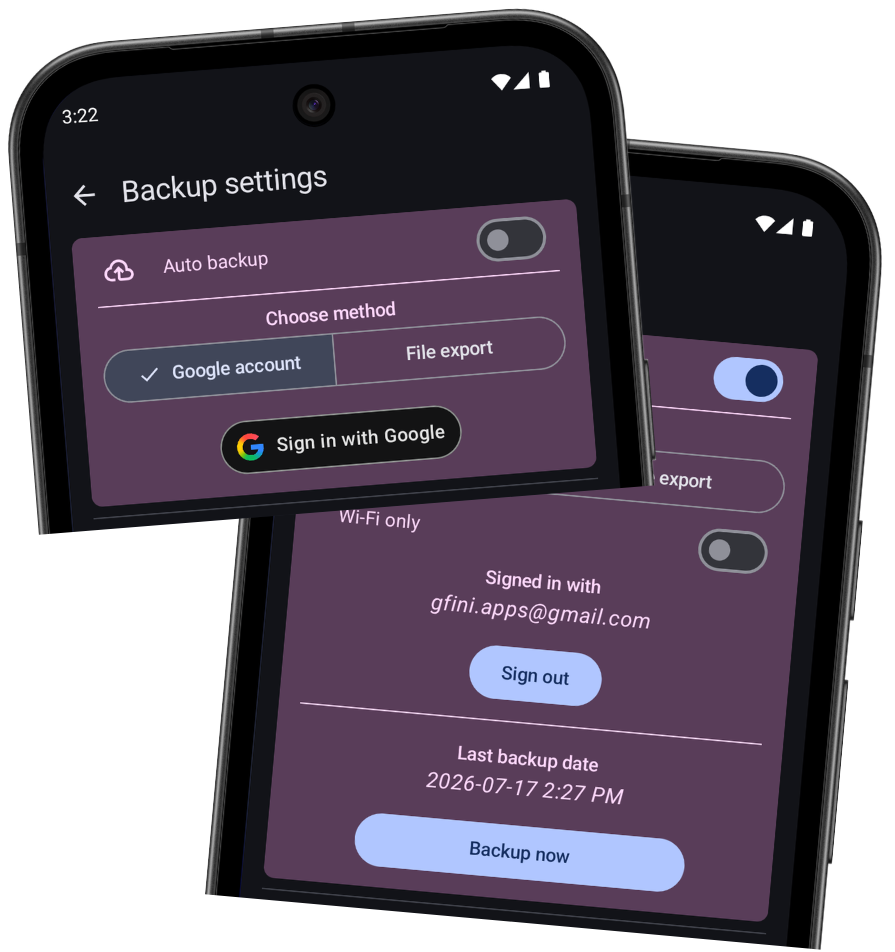
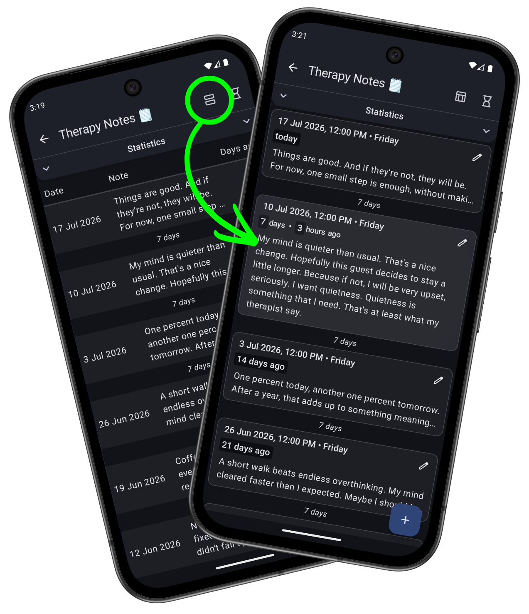

# What’s new in version 1.10

*Published on Google Play: July 18, 2026*

    
    

        <h3>New Automatic Backup Method! 🎉</h3>
        
If you've enabled automatic backups, you've probably noticed that the previous solution wasn't the most reliable. 😄 From now on, no more constant errors! 🟢 You can sign in with your Google account, and backups will be created directly on your Google Drive, without relying on any other apps. 😁

        
If the old method is working fine for you, you can still keep using it. 😉

        
There's also a new button to backup <i>NOW</i>.

    

    

        <h3>New Log List Layout! 🔲</h3>
        
Getting tired of the old-fashioned table view? Meet the new log layout — "blocks"! (will rename to "cards" soon) You can choose the layout separately for each logger, however you prefer. I recommend the new view especially for loggers with longer notes. 📜

        
The table view remains the default, but you can change it in the settings. 😉

    

    

    
    

        <h3>Dynamic Theme! 🎨</h3>
        
For devices running Android 12 or newer, I've enabled support for the "dynamic theme", which automatically adapts the app's colors to match your current wallpaper. If you're getting bored of the standard color palette, it's a nice way to refresh the interface. 😊

        
And if you don't like the automatic colors, you can disable this feature in the settings. 😉

    

### A Few Other Improvements
- **UI Improvement** 📲: The toggle animation finally moves vertically instead of awkwardly at an angle... 🤪
- **UI Improvement** ⚙️: When you open the Settings screen, its icon in the navigation drawer is now highlighted, just like the other navigation items. 😌
- **Bug Fix** 🪲: The backup file link available in the log of the first backup in the "App Monitor 🖥️" now works on Android 11 and newer.

---
#### Previous versions
[v1.5](/en/version/1.5?src=v1.10) • [v1.6](/en/version/1.6?src=v1.10) • [v1.7](/en/version/1.7?src=v1.10) • [v1.8](/en/version/1.8?src=v1.10) • [v1.9](/en/version/1.9?src=v1.10)

---
<a href="/en/?src=v1.10">Go to the homepage</a>
