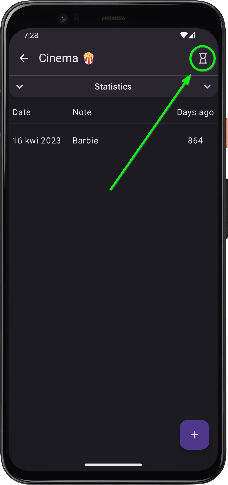
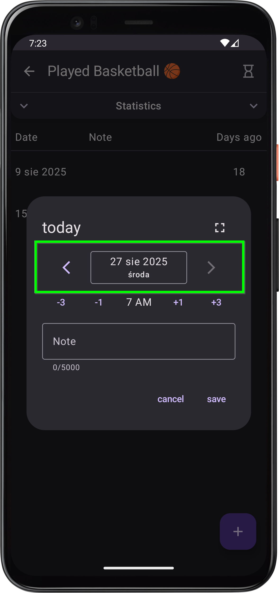

# What’s new in version 1.5

*release date in Play Store (for closed testers): 07.02.2025*

    
    

        <h3>Hourglasses ⏳</h3>
        
This is the main and key update of version 1.5. From now on, you can set a flexible reminder for each logger, which will notify you when a certain amount of time has passed since an event! I won’t tell you what happens when you click that innocent little icon – feel the thrill of discovery! 🤠

    

    

        <h3>New date input component 📆</h3>
        
Life has never been so simple: jump from day to day with a single tap! 😄

    

    

### A few other small fixes
- Pressing "back" ◀️ now closes an open dialog instead of going to the previous page or closing the app.
- Improved the experience of editing long notes 📜 by automatically scrolling to the cursor.
- On small screens (or with oversized keyboards), sometimes parts of a dialog could become inaccessible – from now on, dialogs are scrollable 👆.
- And a few even smaller fixes, not worth listing one by one, but trust me – it’s thanks to these everyday improvements that My Logger becomes an app you can rely on 🎖️.

---
<a href="/en/">Go to the homepage</a>
