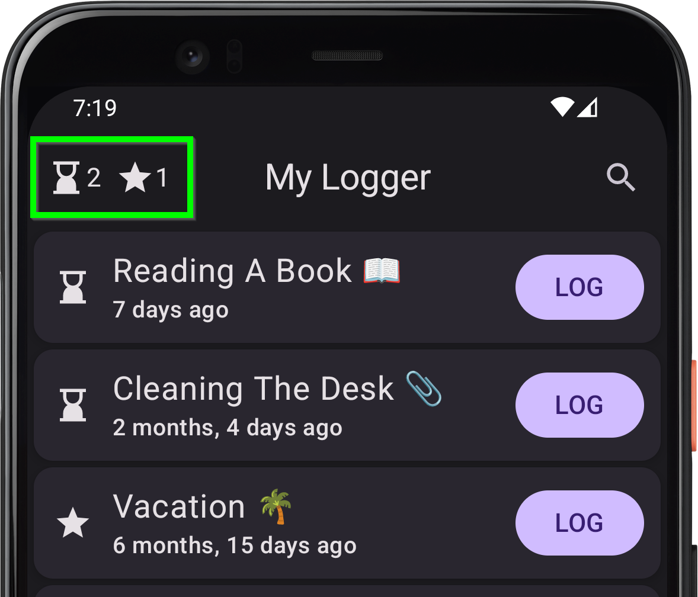

# What’s new in version 1.6

*release date in Play Store (for closed testers): 24.05.2025*

    
    

        <h3>New look for STATISTICS! 📊</h3>
        
Let the "BEFORE" and "AFTER" comparison speak for itself! Until now, statistics were plain, hard-to-read text, and now they are beautiful tables! 🤩 Additionally, yearly statistics have been added alongside weekly and monthly stats 🎆, and each period now includes a trend compared to the previous one.

        
<i>P.S. Charts are planned, stay tuned!</i> 🤘

    

    

        <h3>Banners announcing new versions 🆕</h3>
        
Starting from version 1.6, after installing a new version of the app that introduces new features, a banner will appear. Clicking it will take you to a page with information about these new features (probably how you ended up here 😄).

        
When a new version is ready to install, a banner will appear that links directly to the Google Play Store. If the new version includes new features, the banner will also include a link to a page like this one so you can see what’s coming in the update 😊.

    

    

    
    

        <h3>Hourglass ⏳ and star ⭐ counters</h3>
        
If you use the app intensively, you might log several hourglasses per day. If you also have a few pinned loggers, the home screen can get a bit cluttered. I’m working on a solution, but for now, a counter has been added so you can see at a glance how many tasks are waiting for you each day! 😄

    

### A few other small fixes
- **bugfix** 🪲: After a phone restart, the "Log Reminder" was disabled by the system – now it will automatically reset without any action needed.
- **bugfix** 🪲: Links in notes can now start with numbers (e.g., *4fizjo.pl*) and will be detected correctly.
- **UI improvement** 📲: Smoother appearance of logging dialogs with gradual background dimming.
- **consistency improvement** ☯️: In the notification about missed hourglasses, the count of *pending* hourglasses now only includes the *reminder* hourglasses, excluding those not marked as reminders.
- **consistency improvement** ☯️: Logger creation and modification dates have been moved from statistics to the logger modification dialog.
- **information density improvement** 📰: Duplicate information has been removed from individual settings screens, replaced with a general explanation of each setting.

---
#### Previous versions
[v1.5](/en/version/1.5?src=v1.6)

---
<a href="/en/?src=v1.6">Go to the homepage</a>
