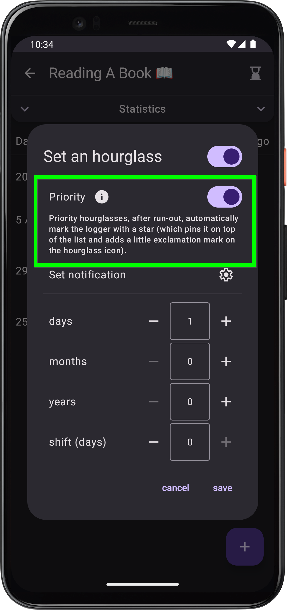
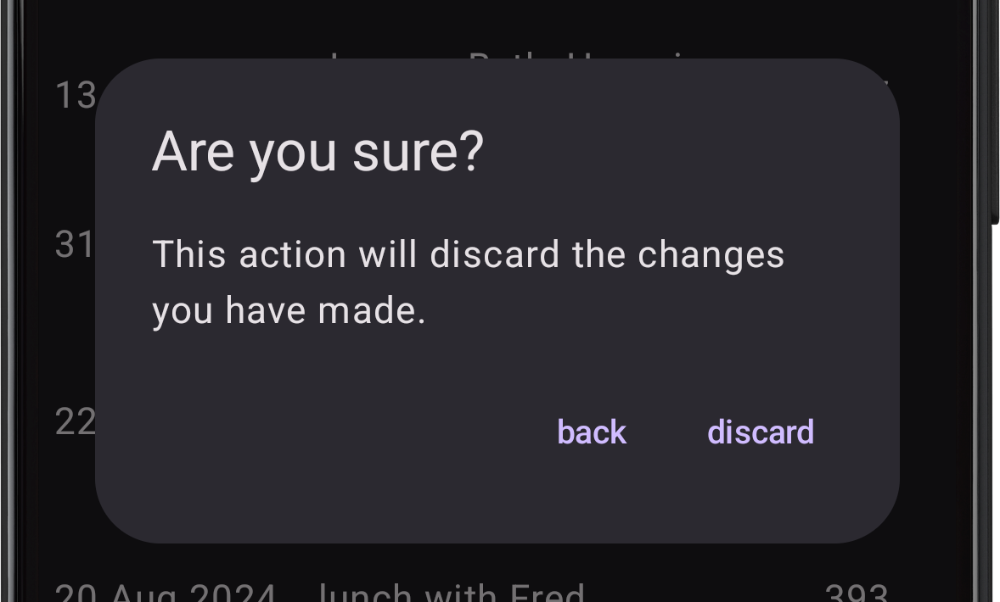

# What’s new in version 1.7

*release date in Play Store: 23.11.2025 (24.09.2025 for closed testers)*

    
    

        <h3>Priority hourglasses❕</h3>
        
You probably didn’t even notice the setting for whether an hourglass is "reminding" – and I totally get it! The setting was unclear (even misleading 🥸) and didn’t add much. Time for a change! From now on, you can mark any hourglass as "priority", which will automatically pin its logger to the top of the list once it runs out. Priority also affects notification (when there are no newly expired hourglasses, a notification will appear only if there’s an overdue priority one), and in the future it will influence upcoming features as well 😉.

    

    

        <h3>Protection against accidentally discarding changes ❌🔒</h3>
        
Have you ever accidentally clicked "cancel" while writing or editing a note? That must have been frustrating! 😫 From now on, before discarding changes, you’ll need to confirm that this is really what you want to do 🙂.

    

    

### A few other small fixes
- **UI improvement** 📲: The "cancel" button label has been changed to "close", "discard", or "back", depending on context.
- **bugfix** 🪲: Improvements to automatic backup creation, increasing the reliability of my custom-built solution.

---
#### Previous versions
[v1.5](/en/version/1.5?src=v1.7), [v1.6](/en/version/1.6?src=v1.7)

---
<a href="/en/?src=v1.7">Go to the homepage</a>
