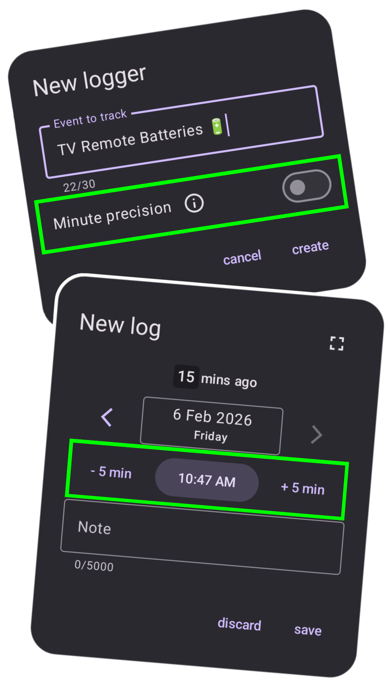
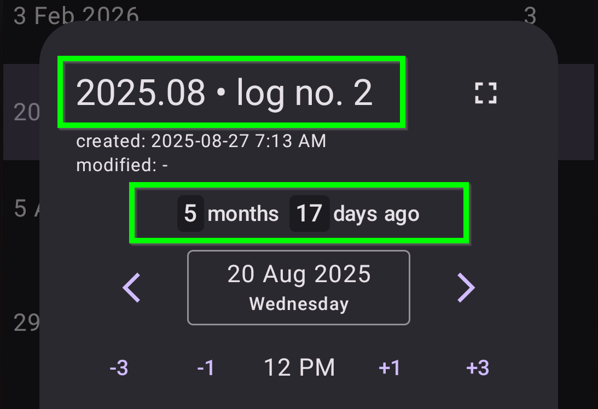

# What’s new in version 1.8

*release date in Play Store: not yet (even for closed testers)*

    
    

        <h3>Minute-level precision 🕥</h3>
        
From now on, loggers can record the exact time — including minutes! By default, everything works the old way, but if you need more precision, just toggle the switch and you’re done.

        
The exact time is selected using the standard Android time picker, but for convenience I’ve also added +/-5 min buttons.

        
What else changes for precise loggers? See for yourself! 😊

    

    

        <h3>New look of the logging screen 📝</h3>
        
The time elapsed since a given log has been moved from the dialog title to a dedicated section above the date picker. This makes it cleaner and more readable, and you can now see this information also when logging directly from the home screen.

        
In place of the title, I added an automatically generated “log name” that tells you which log number it is within the current month.

    

    

### A few other small fixes
- **UI improvement** 📲: The displayed time elapsed since a given log is now updated in real time (to the minute).
- **bugfix** 🪲: Another fix to the link-detection regex — it now correctly matches subdomains consisting only of digits, e.g. 3.basecamp.com.

---
#### Previous versions
[v1.5](/en/version/1.5?src=v1.8), [v1.6](/en/version/1.6?src=v1.8), [v1.7](/en/version/1.7?src=v1.8)

---
<a href="/en/?src=v1.8">Go to the homepage</a>
