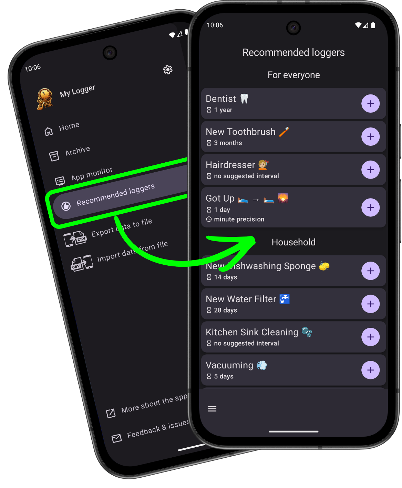
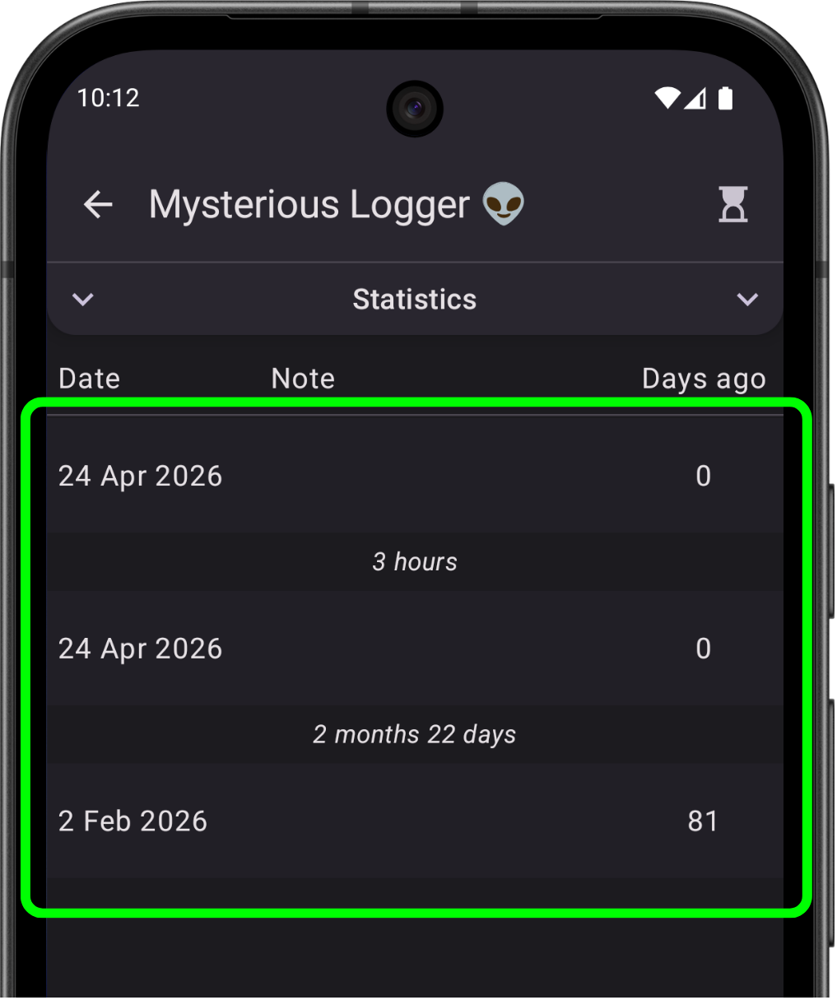

# What’s new in version 1.9

*release date in Play Store: (24.04 for internal testers)*

    
    

        <h3>Recommended loggers 👍</h3>
        
Looking for inspiration? ✨ You can now check what loggers other users recommend! And create them with a single tap 😉

        
For now, this is a static list based on suggestions I personally received from users, but who knows — maybe in the future you’ll be able to share your own ideas directly in the app! 😃

    

    

        <h3>Displaying time between logs ⏱️</h3>
        
In the single logger view, the time elapsed between consecutive logs is now displayed.

        
By the way, in version 1.10 there will be a new log view — possibly better 😉

    

    

### A few other small fixes
- **UI improvement** 📲: In the single logger log view, a newly added log will flash to make it easier to find.
- **Feature improvement** 🔍: The logger search field now treats spaces as an `AND` operator in search conditions. For example, the phrase "ex up" will match a logger like "Exercise: Push-ups". This removes the need to remember the exact word order in loggers names.
- **Bugfix** 🪲: After returning to the app, it sometimes took up to a minute for displayed times to update — now they are always current, while also reducing CPU usage.

---
#### Previous versions
[v1.5](/en/version/1.5?src=v1.9), [v1.6](/en/version/1.6?src=v1.9), [v1.7](/en/version/1.7?src=v1.9), [v1.8](/en/version/1.8?src=v1.9)

---
<a href="/en/?src=v1.9">Go to the homepage</a>
