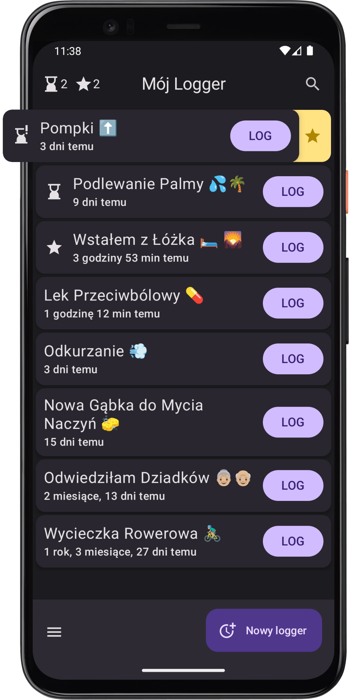

# My Logger

    
    

        <h3>Co to za apka?</h3>
        
My Logger to aplikacja na Androida, która pozwala szybko i wygodnie zapisywać (logować) i śledzić wydarzenia z Twojego życia w uporządkowany sposób. Kiedy ostatnio wydarzyło się <i>x</i>? 🤔 Jak często się to dzieje? Ile razy wydarzyło się to w ciągu ostatniego miesiąca? Dzieje się to coraz częściej, czy coraz rzadziej? A może już czas, by wydarzyło się znów? Z My Loggerem odpowiedzi będziesz mieć zawsze pod ręką! 💪

    

    

        <h3>Co logować?</h3>
        
W tej aplikacji możesz śledzić dowolne wydarzenia i działania. Wiem, że to dość ogólny opis, dlatego nie martw się, jeśli nic nie przychodzi Ci do głowy! Żeby zdobyć trochę inspiracji ✨, możesz zerknąć na <a href="/artykul/co-logowac?src=home">ten artykuł</a>, w którym zaproponowałem kilka kategorii wraz z konkretnymi przykładami 😊.

        
Ogranicza Cię tylko Twoja wyobraźnia 🌌 i ciekawość 🧐.

        <h3>Podstawowe funkcje</h3>
        <ul>
            <li>nieograniczona liczba loggerów (wydarzeń lub działań, które śledzisz)</li>
            <li>nieograniczona liczba logów (wpisów w loggerze)</li>
            <li>wyszukiwanie loggerów (przydatne, gdy masz ich już sporo 😉)</li>
            <li>przypinanie (gwiazdkowanie ⭐) loggerów</li>
            <li>archiwizowanie loggerów</li>
            <li><a href="/version/1.6?src=home#nowy-wygląd-statystyk-📊">statystyki</a> (na razie liczbowe, ze wskaźnikami trendu ⬆️⬇️)</li>
            <li><a href="/version/1.5?src=home#klepsydry-⏳">elastyczny system przypominania</a>, że już czas ⏳ na kolejnego loga</li>
            <li>eksport danych do pliku, w tym możliwość automatycznego, codziennego zapisu np. na Google Drive</li>
        </ul>
    

    

### Wypróbuj już teraz!
Aplikacja jest już publicznie dostępna w [Sklepie Google Play](https://play.google.com/store/apps/details?id=com.gfini.mylogger) 🎉. Obecnie wszystkie funkcjonalności są całkowicie darmowe 😊.

### Chcesz wiedzieć więcej?
Być może już Cię przytłoczyłem ilością informacji, ale jeśli wręcz przeciwnie, zerknij na te artykuły!
- [Korzyści z logowania](artykul/korzysci-z-logowania?src=home)
- [w planach] real-life przykłady moich własnych loggerów
- [w planach] tipy, jak wykorzystać pełen potencjał aplikacji

### Dane i prywatność
Obecnie wszystkie dane, które wprowadzasz do aplikacji, są trzymane na Twoim telefonie. Ja nie mam dostępu do tych danych i nie zbieram żadnych Twoich danych bez Twojej zgody. Tutaj możesz sprawdzić [politykę prywatności](polityka-prywatnosci?src=home).

Jeśli chcesz zabezpieczyć swoje dane na wypadek utraty telefonu, w ustawieniach możesz włączyć automatyczną kopię zapasową lub dokonać ręcznego eksportu danych do pliku CSV. Możesz go potem zaimportować do aplikacji na nowym urządzeniu.

### Wymagania systemowe
Aplikacja działa na wszystkich wersjach Androida od 8.0 Oreo w górę. Jeśli więc twój telefon ma mniej niż 8 lat, będzie się nadawał 🙂.

---
*ostatnia aktualizacja strony: 10.12.2025*
