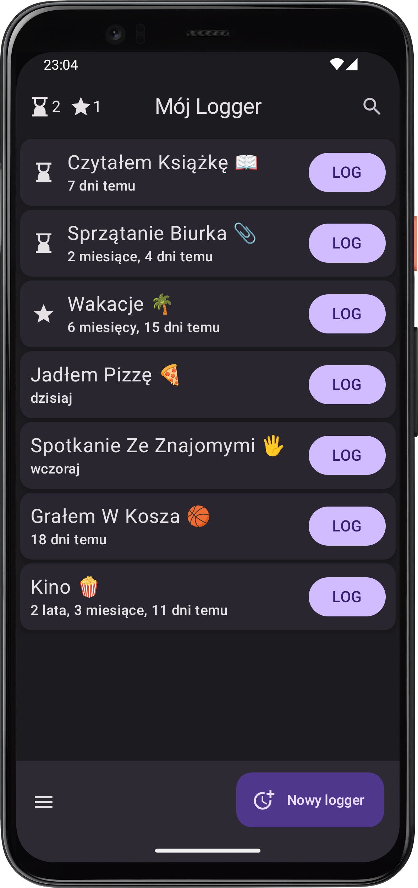

    

# My Logger

    
    

        <h3>Co to za apka?</h3>
        
My Logger to aplikacja na Androida, która pozwala szybko i wygodnie zapisywać (logować) i śledzić wydarzenia z Twojego życia w uporządkowany sposób. Kiedy ostatnio wydarzyło się <i>x</i>? 🤔 Jak często się to dzieje? Ile razy wydarzyło się to w ciągu ostatniego miesiąca? Dzieje się to coraz częściej, czy coraz rzadziej? Poniżej podaję przykłady i wyjaśniam, jak potężne 💪 mogą być odpowiedzi na takie pytania!

    

    

        <h3>Co logować?</h3>
        
W tej aplikacji możesz śledzić dowolne wydarzenia i działania. Jeśli nic nie przychodzi Ci do głowy, może zainspirują Cię poniższe kategorie i przykłady 😊:

        <ol>
            <li>to, co chcesz robić częściej (<a href="/version/1.6#nowy-wygląd-statystyk-📊">statystyki</a> pokażą Ci trend ⬆️⬇️)
                <ul>
                    <li>aktywność fizyczna (spacer, konkretny sport 🏐🏊‍♂️⛳, konkretne ćwiczenie...)</li>
                    <li>inna czynność prozdrowotna (rozciąganie, zimny prysznic, medytacja 🧘‍♀️...)</li>
                    <li>spotkania ze znajomymi, rodziną ❤️</li>
                    <li>czytanie książki 📖 z kawusią ☕</li>
                </ul>
            </li>
            <li>to, co chcesz robić rzadziej
                <ul>
                    <li>szkodliwe nawyki (alkohol 🍷, papierosy, obgryzanie paznokci...)</li>
                    <li>niezdrowe jedzenie (fast foody 🍔, słodycze 🍬...)</li>
                    <li>scrollowanie social mediów 📱</li>
                </ul>
            </li>
            <li>to, co chcesz robić regularnie (<a href="/version/1.5#klepsydry-⏳">elastyczny system przypominania</a> da Ci znać, że już czas ⏳)
                <ul>
                    <li>odkurzanie, sprzątanie 🧹</li>
                    <li>podlewanie kwiatków 🪴</li>
                    <li>czyszczenie kolanka pod zlewem</li>
                </ul>
            </li>
            <li>to, co po prostu interesuje Cię, jak często się dzieje
                <ul>
                    <li>wymiana czegoś: gąbki do mycia naczyń, szczoteczki, baterii 🔋, worka do odkurzacza...</li>
                    <li>coś wkurzającego, co ciągle dzieje się w Twojej pracy :P</li>
                    <li>rzęsa w oku... 👁️🪡</li>
                    <li>wyjście do kina 🍿 lub teatru</li>
                </ul>
            </li>
            <li>to, co się dzieje w pewnym kontekście i chcesz to utrwalić
                <ul>
                    <li>szybki dziennik (np. wspomnienia z wakacji 🏝️, wyjątkowych wydarzeń...)</li>
                    <li>kamienie milowe (np. projektu, procesu dążenia do celu 🎯, realizacji postanowienia...)</li>
                </ul>
            </li>
        </ol>
        
Ogranicza Cię tylko Twoja wyobraźnia ✨ i ciekawość 🧐😊.

    

    

### Chcesz wiedzieć więcej?
Być może już Cię przytłoczyłem ilością informacji, ale jeśli wręcz przeciwnie, zerknij na te artykuły!
- [Korzyści z logowania](korzysci-z-logowania)
- [w planach] real-life przykłady moich własnych loggerów
- [w planach] tipy, jak wykorzystać pełen potencjał aplikacji

### Wypróbuj wersję beta!
Jesteś jedną z tych szczęśliwych osób, która trafiła tu bardzo wcześnie! 🎉 Obecnie aplikacja jest na etapie tworzenia i nie jest publicznie dostępna w Sklepie Play. Nadal jednak możesz ją mieć! Jeśli chcesz **całkowicie za darmo** otrzymać opisane wyżej korzyści, wypełnij <a href="https://forms.gle/1XGxMdjh5RKmZWat8" target="_blank">ten formularz</a>, a ja dam Ci dostęp do wersji beta i wyślę e-maila z linkiem do aplikacji 😊📲.

### Dane i prywatność
Obecnie wszystkie dane, które wprowadzasz do aplikacji, są trzymane na Twoim telefonie. Ja nie mam dostępu do tych danych i nie zbieram żadnych Twoich danych bez Twojej zgody. Tutaj możesz sprawdzić [politykę prywatności](polityka-prywatnosci).

Jeśli chcesz zabezpieczyć swoje dane na wypadek utraty telefonu, w ustawieniach możesz włączyć automatyczną kopię zapasową lub dokonać ręcznego eksportu danych do pliku CSV. Możesz go potem zaimportować do aplikacji na nowym urządzeniu.

### Wymagania systemowe
Aplikacja działa na wszystkich wersjach Androida od 8.0 Oreo w górę. Jeśli więc twój telefon ma mniej niż 8 lat, będzie się nadawał 🙂.

---
*ostatnia aktualizacja: 13.08.2025*
