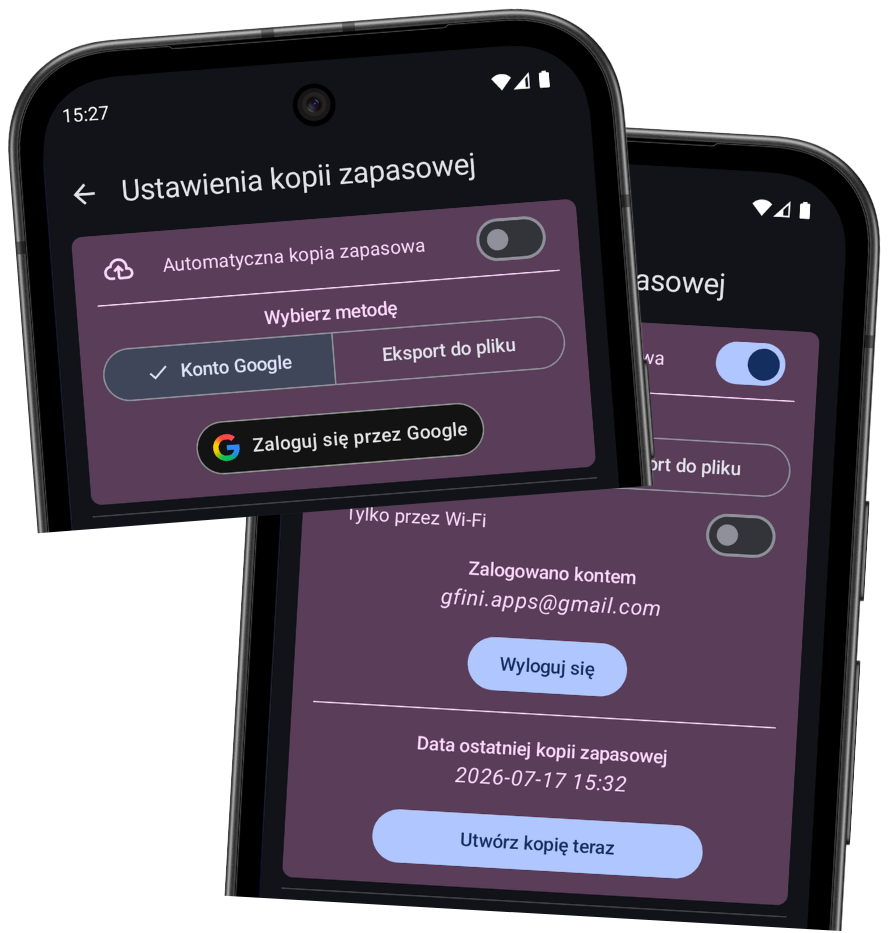
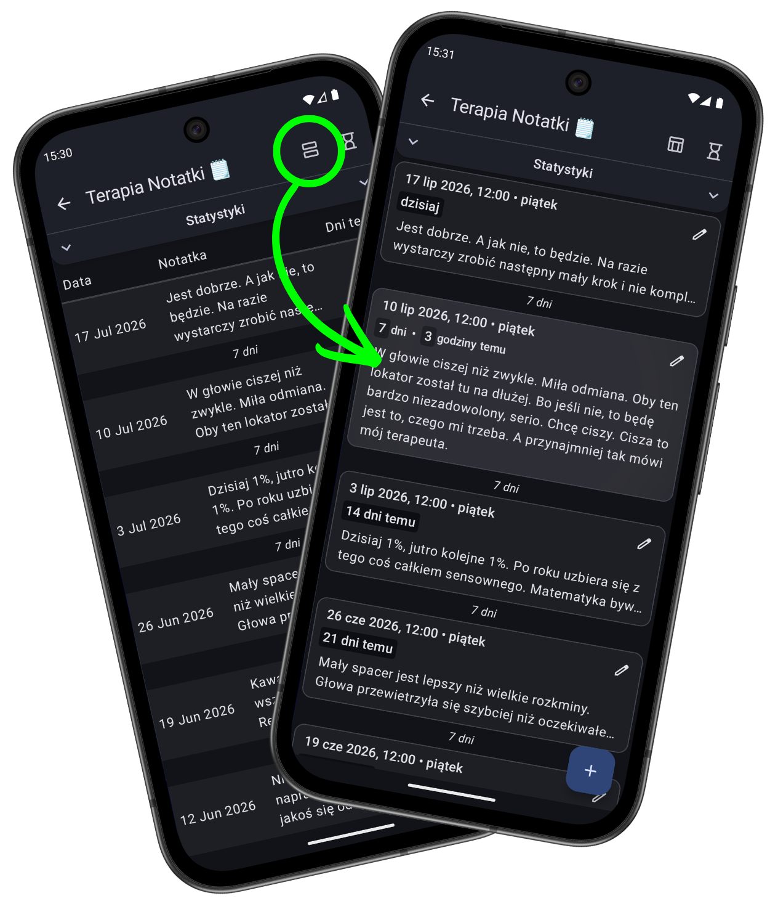
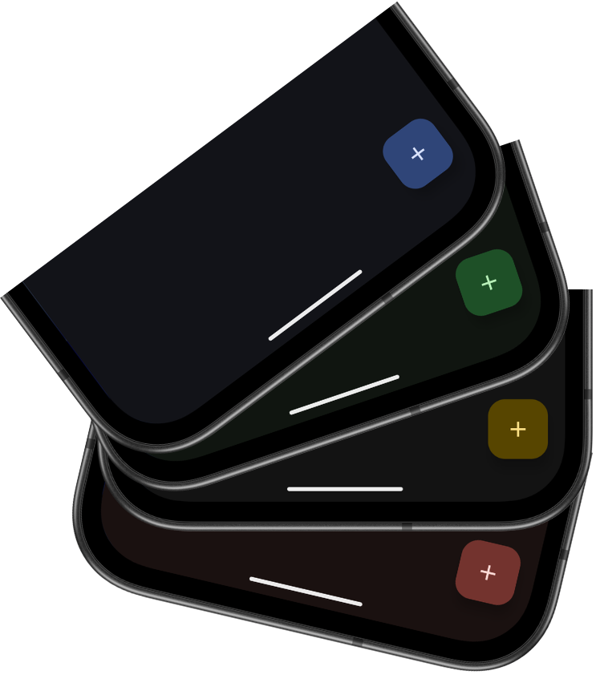

# Co nowego w wersji 1.10

*data publikacji w Sklepie Play: 18.07.2026*

    
    

        <h3>Nowa metoda tworzenia automatycznej kopii zapasowej! 🎉</h3>
        
Jeśli włączyliście automatyczną kopię zapasową, prawdopodobnie wiecie, że dotychczasowe rozwiązanie nie było zbyt stabilne. 😄 Od teraz koniec z ciągłymi błędami! 🟢 Możecie zalogować się swoim kontem Google i kopia zapasowa będzie tworzona bezpośrednio na Waszym Dysku Google, bez pośrednictwa innych aplikacji. 😁

        
Jeśli zaś akurat "u Was działa", to nadal możecie pozostać przy starym mechanizmie. 😉

        
Dodatkowo pojawił się przycisk do wykonania kopii zapasowej <i>TERAZ</i>.

    

    

        <h3>Nowy wygląd listy logów! 🔲</h3>
        
Znudziła Wam się archaiczna "tabelka"? Oto nadszedł nowy widok logów — "bloki"! (pewnie zmienię nazwę na "karty") Dla każdego loggera możecie ustawić widok osobno, tak jak Wam pasuje. Polecam nowy widok szczególnie przy loggerach z dłuższymi notatkami. 📜

        
Domyślnym układem pozostaje tabela, ale możecie to zmienić w ustawieniach. 😉

    

    

    
    

        <h3>Dynamiczny motyw! 🎨</h3>
        
Dla telefonów z Androidem 12 i nowszych, aktywowałem funkcję "dynamicznego motywu", która dostosowuje kolory w aplikacji do tapety, którą aktualnie macie na telefonie. Jeśli znudził Wam się standardowy zestaw barw, jest to miłe odświeżenie interfejsu. 😊

        
A jeśli komuś nie podobają się automatyczne kolory, można wyłączyć tę funkcję w ustawieniach. 😉

    

### Parę innych drobnych poprawek
- **Ulepszenie interfejsu** 📲: Animacja włączanego ustawienia w końcu leci w pionie, a nie jakoś pod kątem... 🤪
- **Ulepszenie interfejsu** ⚙️: Gdy wchodzisz w ustawienia, ikona w panelu bocznym się podświetla, tak jak inne elementy nawigacyjne. 😌
- **Poprawka błędu** 🪲: Link do pliku kopii zapasowej, który można znaleźć w logu o pierwszym backupie w "Monitorze Aplikacji 🖥️", będzie od teraz działać dla Androida 11 i nowszych.

---
#### Poprzednie wersje
[v1.5](/version/1.5?src=v1.10) • [v1.6](/version/1.6?src=v1.10) • [v1.7](/version/1.7?src=v1.10) • [v1.8](/version/1.8?src=v1.10) • [v1.9](/version/1.9?src=v1.10)

---
<a href="/?src=v1.10">Przejdź do strony głównej</a>
