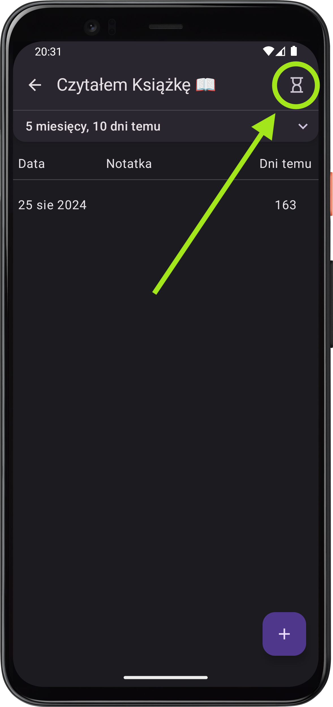
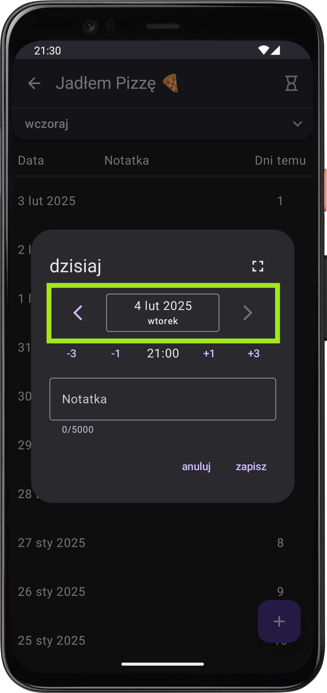

# Co nowego w wersji 1.5

*data publikacji w Sklepie Play (dla closed testerów):  07.02.2025*

    
    

        <h3>Klepsydry ⏳</h3>
        
To jest główny, przewodni i kluczowy update wersji 1.5. Nie powiem Ci jednak, co się stanie, jak klikniesz tę niewinną ikonkę – poczuj dreszczyk odkrywcy! 🤠

    

    

        <h3>Nowy komponent wprowadzania daty 📆</h3>
        
Życie jeszcze nigdy nie było tak proste: przeskakuj z dnia na dzień jednym kliknięciem! 😄

    

    

### Parę innych drobnych poprawek
- kliknięcie "wstecz" ◀️ zamyka otwarte okienko zamiast cofać na poprzednią stronę lub zamykać aplikację
- poprawiony experience modyfikacji długich notatek 📜 poprzez automatyczne scrollowanie do kursora
- na małych ekranach (lub przy przerośniętych klawiaturach) może się zdarzyć, że niektóre elementy w okienku staną się niedostępne – od teraz okienka są scrollowalne 👆
- parę jeszcze drobniejszych poprawek, których wypisywanie byłoby stratą czasu mojego i Twojego, ale zapewniam, że to dzięki nim, tym codziennym, drobnym ulepszeniom, My Logger staje się aplikacją, której możesz zaufać 🎖️.

---
<a href="/">Przejdź do strony głównej</a>