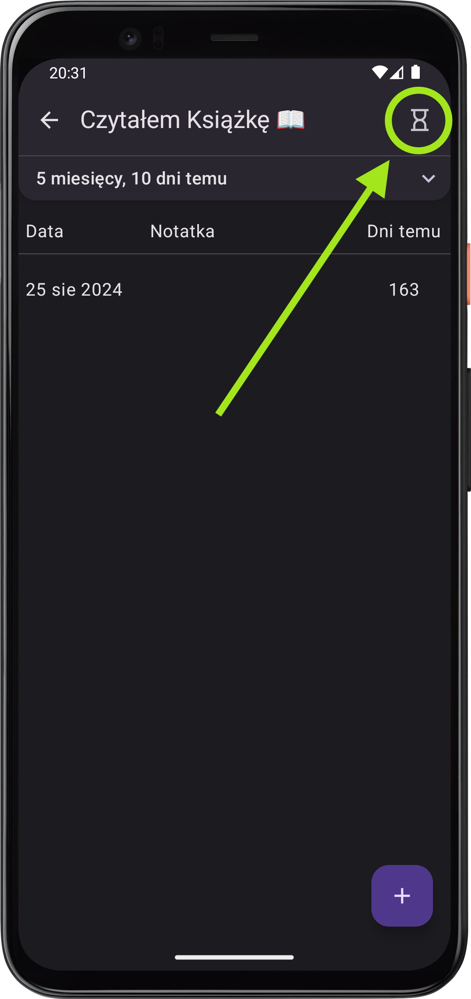
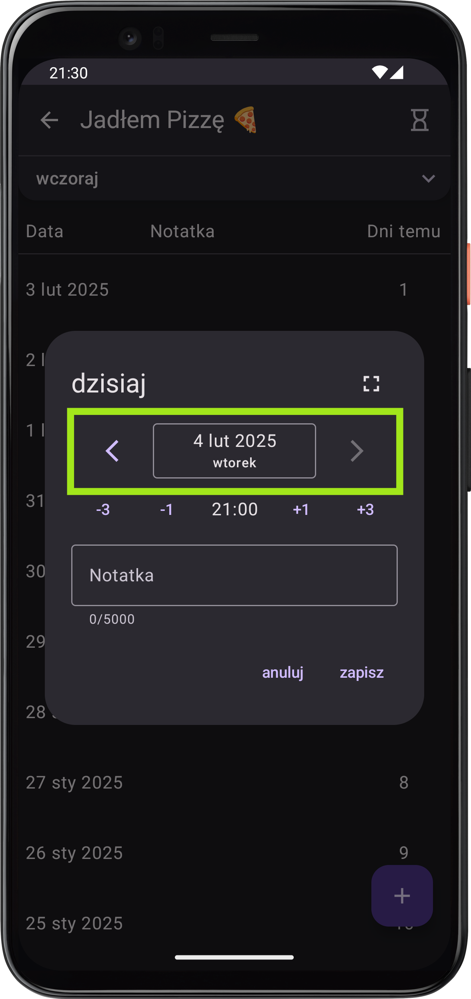

# Co nowego w wersji 1.5

*data publikacji w Sklepie Play (dla closed testerów):  07.02.2025*

    
    

        <h3>Klepsydry ⏳</h3>
        
To jest główny, przewodni i kluczowy update wersji 1.5. Od teraz możesz dla każdego loggera ustawić elastyczne przypomnienie, które poinformuje Cię, gdy od jakiegoś wydarzenia minęła określona przez Ciebie ilość czasu! Nie powiem Ci jednak, co się stanie, gdy klikniesz tę niewinną ikonkę – poczuj dreszczyk odkrywcy! 🤠

    

    

        <h3>Nowy komponent wprowadzania daty 📆</h3>
        
Życie jeszcze nigdy nie było tak proste: przeskakuj z dnia na dzień jednym kliknięciem! 😄

    

    

### Parę innych drobnych poprawek
- Kliknięcie "wstecz" ◀️ zamyka otwarte okienko zamiast cofać na poprzednią stronę lub zamykać aplikację.
- Poprawiony experience modyfikacji długich notatek 📜 poprzez automatyczne scrollowanie do kursora.
- Na małych ekranach (lub przy przerośniętych klawiaturach) może się zdarzyć, że niektóre elementy w okienku staną się niedostępne – od teraz okienka są scrollowalne 👆.
- Parę jeszcze drobniejszych poprawek, których wypisywanie byłoby stratą czasu mojego i Twojego, ale zapewniam, że to dzięki nim, tym codziennym, drobnym ulepszeniom, My Logger staje się aplikacją, której możesz zaufać 🎖️.

---
#### Następne wersje
[v1.6](/version/1.6?src=v1.5), [v1.7](/version/1.7?src=v1.5), [v1.8](/version/1.8?src=v1.5), [v1.9](/version/1.9?src=v1.5)

---
<a href="/?src=v1.5">Przejdź do strony głównej</a>
