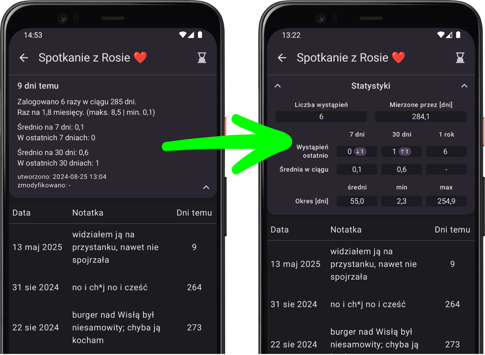
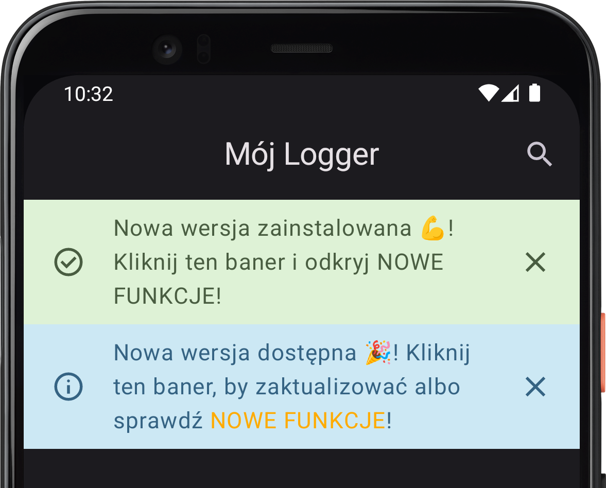
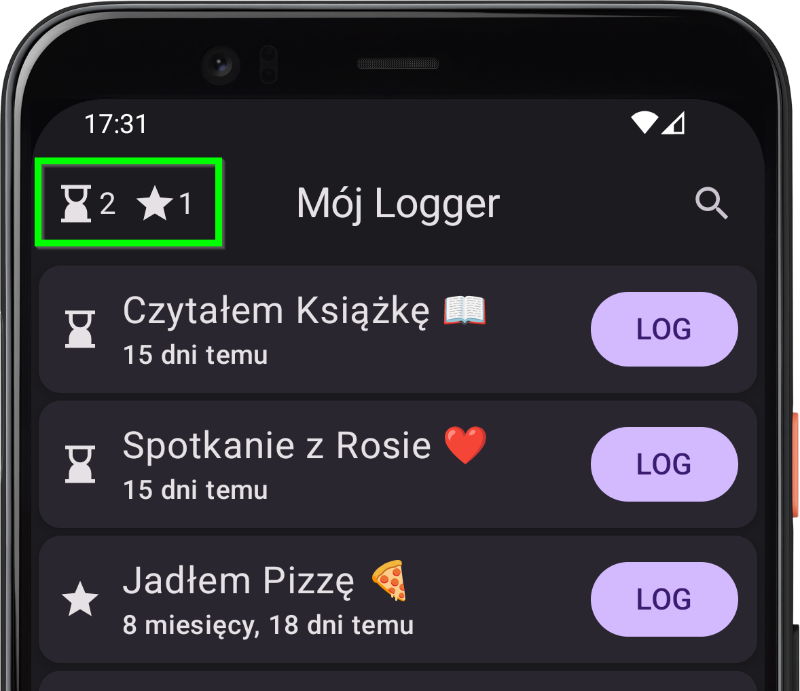

# Co nowego w wersji 1.6

*data publikacji w Sklepie Play (dla closed testerów):  24.05.2025*

    
    

        <h3>Nowy wygląd STATYSTYK! 📊</h3>
        
Niech porównanie "PRZED" i "PO" mówi samo za siebie! Do tej pory statystyki były zwykłym, nieczytelnym tekstem, a teraz to piękne tabelki! 🤩 Dodatkowo do statystyk tygodnia i miesiąca doszły statystyki roku 🎆 oraz do każdego z tych okresów dodany został trend względem okresu poprzedniego.

        
<i>P.S. Na wykresy musisz jeszcze poczekać, ale są w planach!</i> 🤘

    

    

        <h3>Banery informujące o nowych wersjach 🆕</h3>
        
Począwszy od wersji 1.6, po zainstalowaniu nowej wersji aplikacji, gdy będzie ona wprowadzać nowe funkcje, pojawi się baner, który po kliknięciu przekieruje na stronę z informacjami o tych nowych funkcjach (prawdopodobnie tak właśnie tu trafił_ś 😄).

        
Gdy zaś pojawi się nowa wersja gotowa do zainstalowania, pojawi się baner, który po kliknięciu przeniesie Cię do Sklepu Google Play. Gdy nowa wersja będzie dostarczać nowych funkcji, na banerze pojawi się również link do stronki takiej jak ta, byś m_gł_ sprawdzić, co Cię czeka w nowej wersji 😊.

    

    

    
    

        <h3>Licznik klepsydr ⏳ i gwiazdek ⭐</h3>
        
Jeśli używasz aplikacji intensywnie, może się okazać, że dziennie przesypuje Ci się po kilka klepsydr. Jeśli do tego masz trochę przypiętych loggerów, strona główna może się zrobić nieco zaśmiecona. Pracuję już nad rozwiązaniem, ale na ten czas dodaję licznik, żeby na pierwszy rzut oka było wiadomo, jak dużo zadań czeka na Ciebie danego dnia! 😄

    

### Parę innych drobnych poprawek
- **bugfix** 🪲: Przy restarcie telefonu "Przypomnienie o logowaniu" jest wyłączane przez system – od teraz samo się będzie ustawiało ponownie i nie trzeba będzie nic robić.
- **bugfix** 🪲: Od teraz linki w notatkach mogą zaczynać się również od cyfr (np. *4fizjo.pl*) i zostaną poprawnie wykryte.
- **UI improvement** 📲: Łagodniejsze pojawianie się okienek do logowania poprzez stopniowe przyciemnianie tła.
- **consistency improvement** ☯️: W powiadomieniu o przesypanych klepsydrach liczba *zaległych* klepsydr będzie od teraz zawsze mówiła tylko o klepsydrach *przypominających*, czyli tych, które same z siebie wpływają na to powiadomienie, nie będą zaś liczone zaległe klepsydry, które nie są oznaczone jako przypominające.
- **consistency improvement** ☯️: Daty utworzenia i modyfikacji loggera zostały przeniesione ze statystyk do okienka modyfikacji loggera.
- **information density improvement** 📰: Na ekranach z poszczególnymi ustawieniami już nie ma zduplikowanej informacji, a zamiast tego jest dodatkowa, ogólna informacja o tym, co to za ustawienie.

---
#### Poprzednie wersje
[v1.5](/version/1.5)

---
<a href="/">Przejdź do strony głównej</a>