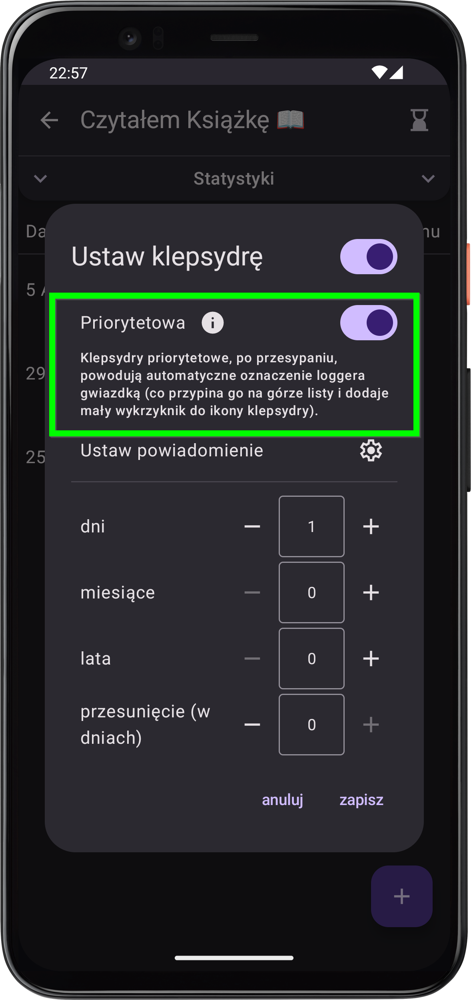

# Co nowego w wersji 1.7

*data publikacji w Sklepie Play: 23.11.2025 (24.09.2025 dla closed testerów)*

    
    

        <h3>Klepsydry priorytetowe❕</h3>
        
Pewnie nawet nie zwrócił_ś uwagi na ustawienie, czy klepsydra jest "przypominająca" – totalnie to rozumiem! Ustawienie było niejasne (a nawet mylące 🥸) i niewiele dawało. Pora na zmianę! Od teraz każdą klepsydrę możesz oznaczyć jako "priorytetową", co automatyczne przypina loggera na górze listy, po jej przesypaniu. Priorytetowość klepsydr ma też wpływ na wyświetlanie powiadomienia (gdy nie ma nowych przesypanych klepsydr, powiadomienie pojawi się tylko wtedy, gdy jest jakaś zaległa priorytetowa klepsydra), a w przyszłości będzie też wpływać na nadchodzące funkcje 😉.

    

    

        <h3>Zabezpieczenie przed przypadkowym odrzuceniem zmian ❌🔒</h3>
        
Zdarzyło Ci się przez przypadek kliknąć "anuluj" podczas pisania bądź edytowania notatki? To musiało być frustrujące! 😫 Od teraz, przed odrzuceniem zmian, trzeba będzie zatwierdzić, że to właśnie chcesz zrobić 🙂.

    

    

### Parę innych drobnych poprawek
- **UI improvement** 📲: Zmiana nazwy przycisku "anuluj" na "zamknij", "odrzuć" lub "wstecz", w zależności od kontekstu.
- **bugfix** 🪲: Poprawki odnośnie tworzenia automatycznej kopii zapasowej, zwiększające niezawodność (mojego autorskiego, niestandardowego) rozwiązania.

---
#### Poprzednie wersje
[v1.5](/version/1.5), [v1.6](/version/1.6)

---
<a href="/">Przejdź do strony głównej</a>
