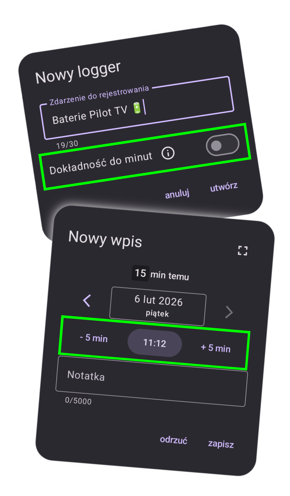

# Co nowego w wersji 1.8

*data publikacji w Sklepie Play: jeszcze nie (08.02.2026 dla closed testerów)*

    
    

        <h3>Dokładność do minut 🕥</h3>
        
Od teraz loggery mogą logować dokładną godzinę — wraz z minutami! Domyślnie będzie po staremu, lecz jeśli potrzebujesz większej precyzji, wystarczy kliknąć przełącznik i gotowe!

        
Dokładną godzinę wybiera się standardowym androidowym komponentem, ale dla wygody dodałem też przyciski +/-5 min.

        
Co jeszcze się zmienia dla dokładnych loggerów? Sprawdźcie sami! 😊

    

    

        <h3>Nowy wygląd okienka logowania 📝</h3>
        
Czas, jaki minął od danego loga, przeniosłem z tytułu okienka do specjalnej sekcji nad wyborem daty. Dzięki temu jest ładniej i czytelniej oraz widzimy ten czas również logując z poziomu ekranu głównego.

        
W miejscu tytułu zaś dodałem automatycznie generowaną "nazwę loga", która mówi nam, który to log z kolei w danym miesiącu.

    

    

### Parę innych drobnych poprawek
- **UI improvement** 📲: Od teraz pokazywane czasy, jakie minęły od danego loga, są aktualizowane w czasie rzeczywistym (co do minuty).
- **bugfix** 🪲: Kolejna poprawka do regex wykrywającego linki — od teraz poprawnie złapie subdomeny składające się z samych cyfr, np. 3.basecamp.com.

---
#### Poprzednie wersje
[v1.5](/version/1.5?src=v1.8), [v1.6](/version/1.6?src=v1.8), [v1.7](/version/1.7?src=v1.8)

---
<a href="/?src=v1.8">Przejdź do strony głównej</a>
