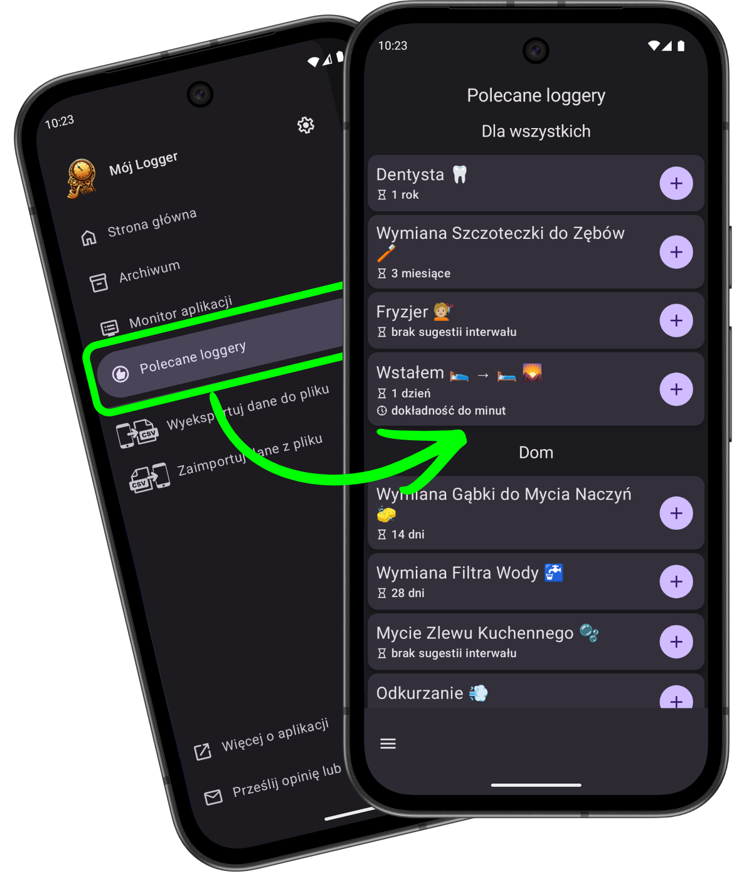
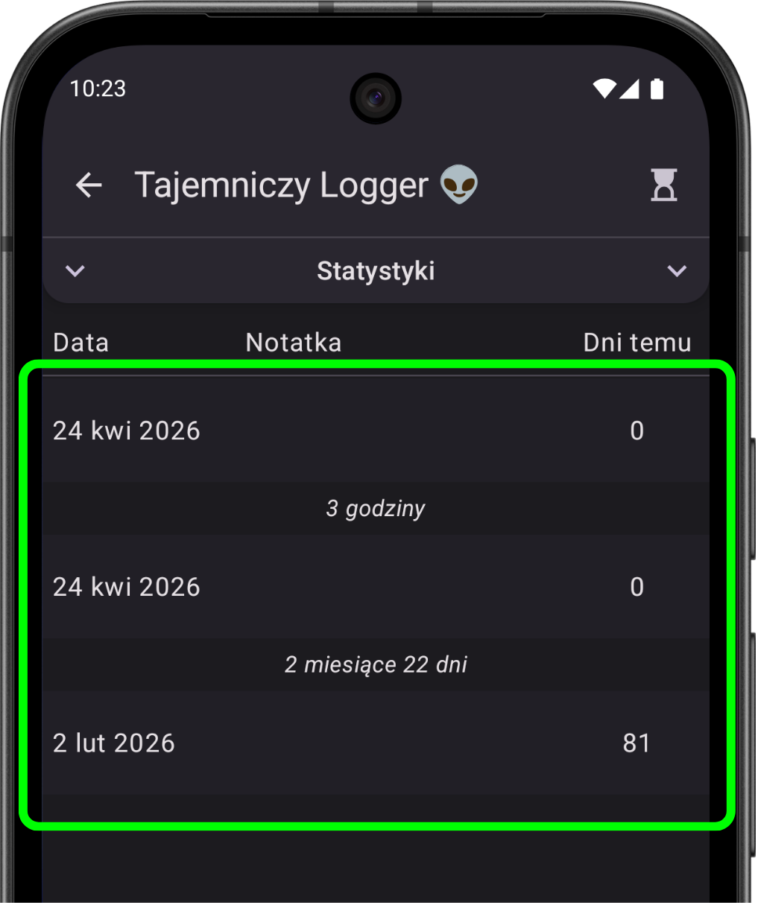

# Co nowego w wersji 1.9

*data publikacji w Sklepie Play: 26.04.2026*

    
    

        <h3>Polecane loggery 👍</h3>
        
Szukasz inspiracji? ✨ Od teraz możesz sprawdzić, jakie loggery polecają inni użytkownicy! I utworzyć je jednym kliknięciem 😉

        
Na ten moment jest to statyczna lista utworzona na podstawie informacji, które osobiście otrzymałem od użytkowników, ale kto wie, może w przyszłości będziesz mógł się podzielić swoim pomysłem bezpośrednio w apce! 😃

    

    

        <h3>Wyświetlanie czasu pomiędzy logami ⏱️</h3>
        
W widoku pojedynczego loggera, pomiędzy logami, będzie pokazany czas, jaki minął od jednego do drugiego.

        
Przy okazji zdradzę, że w wersji 1.10 pojawi się nowy widok logów — trochę inaczej działający i wyglądający 😉

    

    

### Parę innych drobnych poprawek
- **Ulepszenie interfejsu** 📲: W widoku logów pojedynczego loggera, nowo dodany log na chwilę się podświetli, żeby ułatwić jego zlokalizowanie.
- **Ulepszenie funkcji** 🔍: Pole wyszukiwania loggerów będzie od teraz traktować spację jako łącznik `AND` w warunkach wyszukiwania. Czyli fraza `"wi po"` wyszuka np. logger `"Ćwiczenie: Pompki"`. Dzięki temu nie trzeba pamiętać kolejności słów w nazwach loggerów.
- **Poprawka błędu** 🪲: Gdy wróciło się do apki po przerwie, zdarzało się, że trzeba było poczekać nawet minutę, żeby pokazywane czasy się zaktualizowały — od teraz zawsze będą aktualne (i to ze zmniejszonym użyciem procesora 😎).

---
#### Poprzednie wersje
[v1.5](/version/1.5?src=v1.9), [v1.6](/version/1.6?src=v1.9), [v1.7](/version/1.7?src=v1.9), [v1.8](/version/1.8?src=v1.9)

---
<a href="/?src=v1.9">Przejdź do strony głównej</a>
